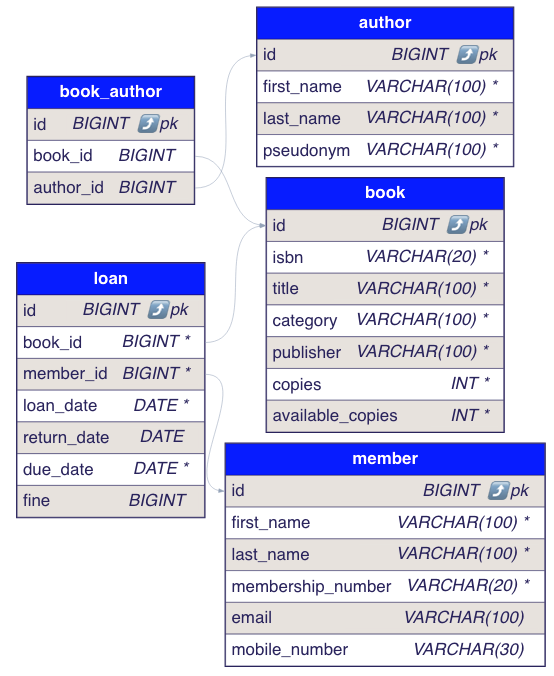

# GROW Inc - Library Management System

## Overview

This project is a Library Management System built using Spring Boot. It showcases:
- Proper use of inheritance and composition.
- Application of the Liskov Substitution Principle.
- Implementation of the Strategy pattern for different book search algorithms.
- Use of the Observer pattern for notifying users about due dates.
- Basic unit tests demonstrating understanding of testable code.

## System Design

### Data Model

Below is a sample data model for the system. Properties are incomplete but this is enough to show the relationships between the entities.

Note: see comments in DDL for the constraints / indexes that would be beneficial for the minimum requirements.



created from: https://www.devtoolsdaily.com/sql/ddl-to-diagram/
```
CREATE DATABASE IF NOT EXISTS library;
USE library;

CREATE TABLE book
(
id BIGINT AUTO_INCREMENT,
isbn VARCHAR(20) NOT NULL,
title VARCHAR(100) NOT NULL,
category VARCHAR(100) NOT NULL,
publisher VARCHAR(100) NOT NULL,
copies INT NOT NULL,
available_copies INT NOT NULL,
PRIMARY KEY (id)
);
-- ADD INDEX on isbn, title
-- ADD UNIQUE INDEX on isbn

CREATE TABLE member (
id BIGINT AUTO_INCREMENT,
first_name VARCHAR(100) NOT NULL,
last_name VARCHAR(100) NOT NULL,
membership_number VARCHAR(20) NOT NULL,
email VARCHAR(100),
mobile_number VARCHAR(30),
PRIMARY KEY (id)
);

CREATE TABLE author
(
id BIGINT AUTO_INCREMENT,
first_name VARCHAR(100) NOT NULL,
last_name VARCHAR(100) NOT NULL,
pseudonym VARCHAR(100) NOT NULL,
PRIMARY KEY (id)
);
-- ADD INDEX on first_name, last_name

CREATE TABLE book_author
(
id BIGINT AUTO_INCREMENT,
book_id BIGINT,
author_id  BIGINT,
PRIMARY KEY (id),
FOREIGN KEY (book_id) REFERENCES book (id),
FOREIGN KEY (author_id) REFERENCES author (id)
);

CREATE TABLE loan
(
id BIGINT AUTO_INCREMENT,
book_id BIGINT NOT NULL,
member_id BIGINT NOT NULL,
loan_date DATE NOT NULL,
return_date DATE,
due_date DATE NOT NULL,
fine BIGINT,
PRIMARY KEY (id),
FOREIGN KEY (book_id) REFERENCES book (id),
FOREIGN KEY (member_id) REFERENCES member (id)
);
-- ADD INDEX on due_date
```

### API Endpoints

These are the available APIs to demonstrate the minimum requirement (Book Search):

- `GET /library/books`: Get a list of all books.
- `GET /library/books/{id}`: Get book by id.
- `POST /library/books/search`: Search books by title, author, isbn, or combination of.
- `POST /library/books`: Create book.

However, more APIs are needed to complete the library management system:

#### Author APIs

- `GET /library/authors`: Get a list of all authors.
- `GET /library/authors/{id}`: Get author by id.
- `POST /library/authors`: Create author.
- `PUT /library/authors/{id}`: Update author.
- `DELETE /library/authors/{id}` : Delete author.

#### Member APIs

- `GET /library/members`: Get a list of all members.
- `GET /library/members/{id}`: Get member by id.
- `POST /library/members`: Create member.
- `PUT /library/members/{id}`: Update member.
- `DELETE /library/members/{id}` : Delete member.

#### Loan APIs

- `GET /library/loans`: Get a list of all loans.
- `GET /library/loans/{id}`: Get loan by id.
- `POST /library/loans`: Create loan.
- `PUT /library/loans/{id}`: Update loan.

### Additional Considerations - not implemented 
- Performance Optimizations: indexing/query optimizations, caching,
- User Interface
- Security: Authentication / Authorization